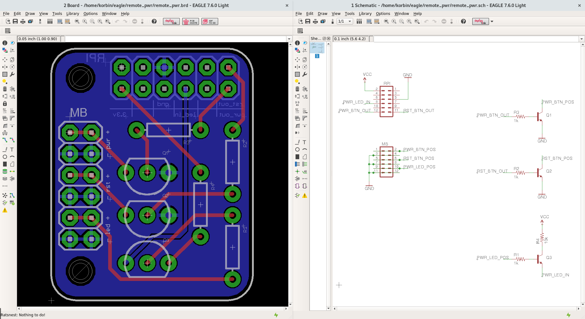

Remote Power (RPi HAT)
=========================
Remotely query/change the power state of a computer from an always on, low power Raspberry Pi.

Intended to be used over SSH to control the power state of a desktop computer.

Includes EAGLE board schematic for a RPi HAT which the computer's front panel header connect to. And python scripts which can then be executed on the RPi to query/change the power state of the connected computer.

EAGLE board and schematic
--------


Python script use
--------
```bash
# Query the power state
./remote_pwr state

# "Push" the power or reset buttons
./remote_pwr pulse pwr
./remote_pwr pulse rst

# "Hold" the power button
./remote_pwr hold pwr
```
